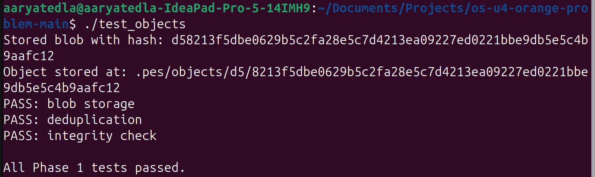
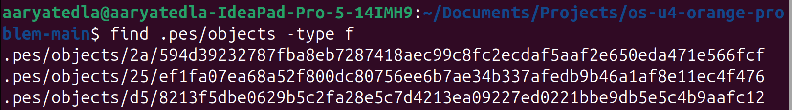
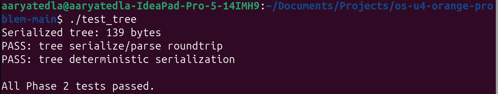
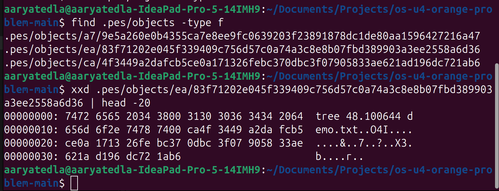
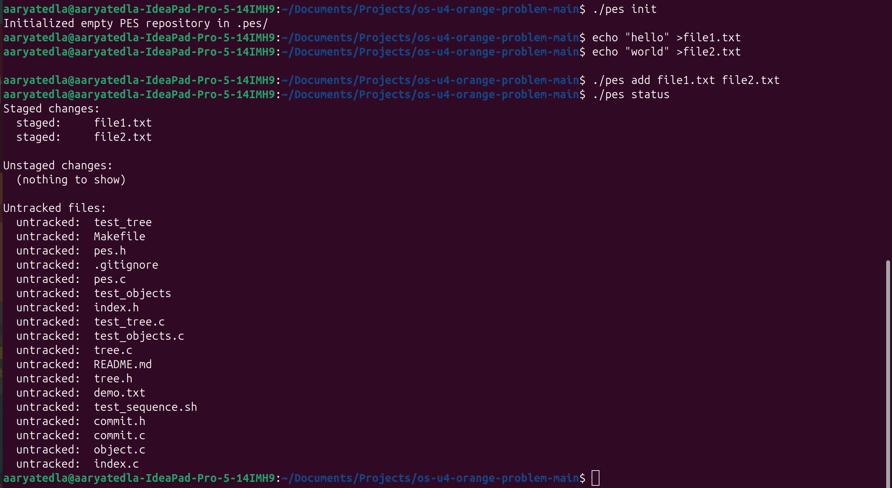
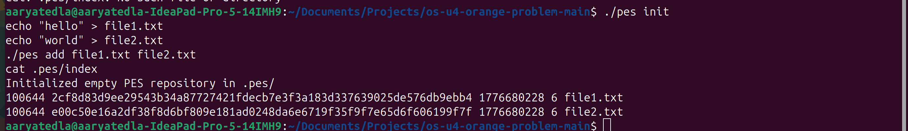
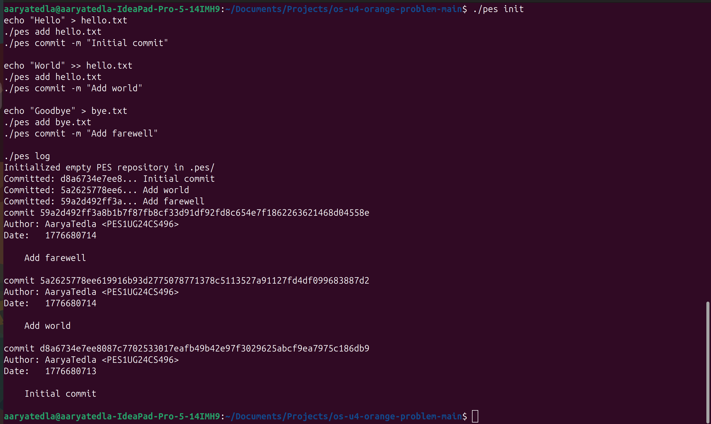
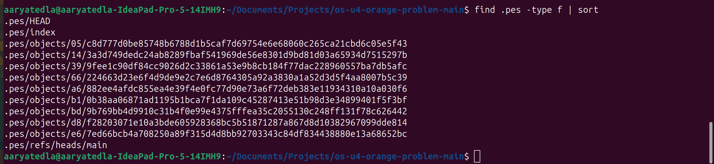
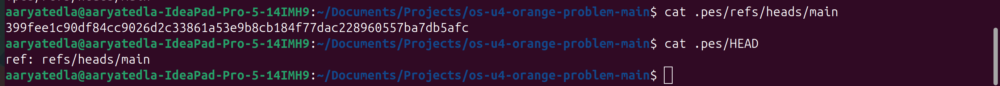
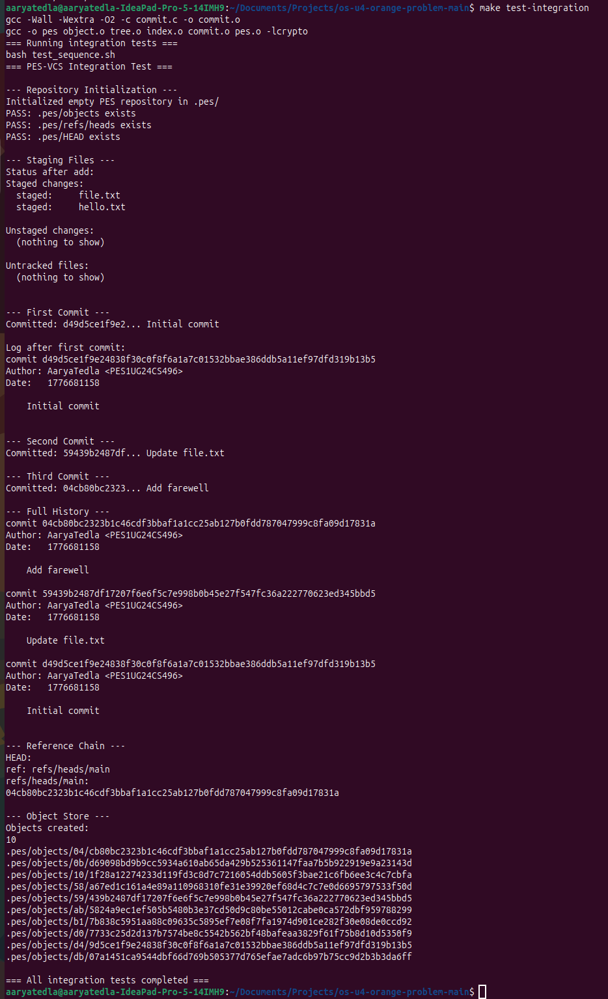

# PES-VCS Lab Report

## Student and Repository Details

- Name: Aarya Tedla
- SRN: PES1UG24CS496
- Repository: https://github.com/AaryaTedla/PES1UG24CS496-pes-vcs
- Platform: Ubuntu 22.04

## Implemented Files

- object.c
- tree.c
- index.c
- commit.c

## Screenshot Evidence

### Phase 1

#### 1A - test_objects output

#### 1B - object store sharding

### Phase 2

#### 2A - test_tree output

#### 2B - raw tree object bytes via xxd

### Phase 3

#### 3A - init, add, status flow

#### 3B - text format of .pes/index

### Phase 4

#### 4A - commit history with three commits

#### 4B - full .pes file/object growth

#### 4C - branch ref and HEAD chain

### Final Integration Test

#### make test-integration

## Analysis Questions

### Q5.1 - How checkout would work

A checkout operation would update the following metadata files in .pes:

- .pes/HEAD (to point to the selected branch, or to a direct commit hash in detached mode)
- .pes/refs/heads/<branch> (if branch creation/update is involved)
- .pes/index (to match the checked-out tree snapshot)

Then the working directory must be rewritten to match the target commit tree:

- create/update files present in target tree
- remove tracked files not present in target tree
- apply executable vs non-executable mode as represented by tree modes

The complex part is safety and correctness:

- detecting conflicts with uncommitted local changes
- handling nested trees recursively
- making the transition atomic enough to avoid half-switched states if interrupted

### Q5.2 - Dirty working directory conflict detection

Using only index and object store, conflict detection can be done as:

1. Resolve target branch tip commit, parse its tree recursively, and compute target path -> blob hash map.
2. Resolve current HEAD commit and current index path -> blob hash map.
3. For each tracked path in index, compare working file content against indexed blob hash:
   - if content differs, path is dirty.
4. For each dirty path, check whether target branch version differs from current branch version for the same path.
5. If both are different, checkout must refuse, because switching would overwrite local changes.

This is equivalent to “local modified + branch change on same path = conflict”.

### Q5.3 - Detached HEAD behavior and recovery

In detached HEAD state, new commits are still created normally, but HEAD points directly to a commit hash instead of a branch ref file. That means new commits are not advanced by any named branch, so they can become unreachable later.

Recovery options:

- create a new branch ref pointing to the detached commit chain
- or move an existing branch to that commit deliberately

As long as commit hashes are known (from log/reflog-like history), commits can be rescued by reattaching a branch to them.

### Q6.1 - Reachability-based garbage collection

A safe GC algorithm:

1. Build root set from all refs under .pes/refs/heads and possibly detached HEAD commit.
2. Traverse commit graph from each root:
   - mark commit object reachable
   - mark its tree reachable
   - recursively mark all subtree/tree/blob objects reachable
   - follow parent commit links
3. After mark phase, scan all object files under .pes/objects.
4. Delete any object not in reachable set.

Best data structure for reachable set: hash set of 32-byte object IDs (or hex IDs) for O(1) average membership checks.

Scale estimate for 100,000 commits and 50 branches:

- commit objects visited: up to around 100,000 unique commits (branches usually overlap heavily)
- plus reachable trees and blobs for snapshots
- total visited objects can be several multiples of commits depending on file churn; commonly hundreds of thousands to low millions in active repos

### Q6.2 - Why concurrent GC is dangerous

Race example:

1. Commit process writes new blobs/trees.
2. Before commit ref update, objects are not yet reachable from any branch ref.
3. Concurrent GC scans refs, does not see those new objects as reachable, and deletes them.
4. Commit process then writes commit/ref pointing to now-missing objects, producing corruption.

How real Git avoids this:

- coordination/locking around GC and ref updates
- grace periods and conservative pruning rules
- temporary retention via recent-object mechanisms and reflog-based reachability windows
- only pruning objects proven unreachable beyond safety thresholds

These reduce chances of deleting objects that are in-flight or recently referenced.
